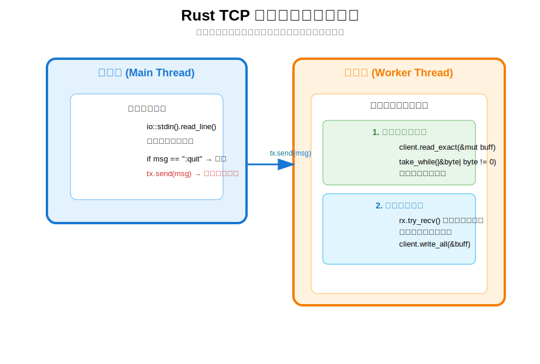

# Rust TCP 聊天客户端（初学者版）

这是一个使用 Rust 标准库实现的简单 TCP 聊天客户端，用于配合之前的服务器使用。

## 客户端工作流程图



## 客户端整体架构

客户端采用 **双线程模型**：

- **主线程**：负责读取用户键盘输入，并将消息通过通道发送给子线程
- **子线程**：同时负责两件事：
  1. 持续接收服务器发来的消息并打印
  2. 接收主线程传来的消息并发送给服务器

这种设计避免了输入和接收互相阻塞的问题。

---

## 核心概念说明

### 1. mpsc 通道的作用

```rust
let (tx, rx) = mpsc::channel::<String>();
```

- `tx`（发送端）：主线程持有，用于把用户输入的消息传递给子线程
- `rx`（接收端）：子线程持有，用于接收主线程发来的消息
- 通过通道实现线程间安全通信

### 2. 非阻塞 I/O

```rust
client.set_nonblocking(true);
```

客户端 Socket 设置为非阻塞模式：

- `read_exact()` 没有数据时返回 `WouldBlock` 错误，不会卡住线程
- 使用 `match + ErrorKind::WouldBlock` 来忽略这种正常情况

### 3. 子线程工作循环

子线程在一个 `loop` 中同时做两件事：

1. 尝试从服务器读取消息（接收）
2. 尝试从主线程接收消息并发送（发送）

两者都使用非阻塞方式，不会互相阻塞。

### 4. 退出机制

- 用户输入 `:quit` 时退出
- 通道断开或连接错误时自动退出

---

## 代码结构概览

```rust
// 主线程流程
loop {
    // 1. 读取用户输入
    io::stdin().read_line(&mut msg);
    
    // 2. 检查退出命令
    if msg.trim() == ":quit" { break; }
    
    // 3. 发送给子线程
    tx.send(msg);
}

// 子线程流程
loop {
    // 1. 接收服务器消息
    match client.read_exact(&mut buff) {
        Ok(_) => 解析并打印消息,
        Err(WouldBlock) => 忽略,
        Err(_) => break,
    }
    
    // 2. 发送消息给服务器
    if let Ok(msg) = rx.try_recv() {
        client.write_all(&buff);
    }
}
```
