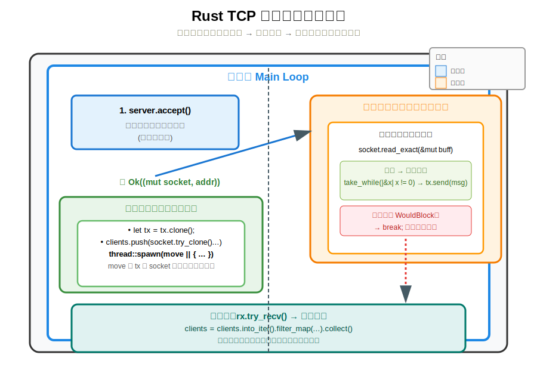

# Rust 聊天室服务器代码解析

## 服务器工作流程图



## 1. `let tx = tx.clone();` 为什么要克隆？

因为 `mpsc::channel` 的发送端 `Sender` 是支持克隆的（多生产者）。

- 外面的 `tx` 是主线程持有的。
- 每个新连接的客户端都需要自己拥有一个发送端，用来把收到的消息发给主线程。
- Rust 的所有权规则很严格：一个值只能有一个所有者。
- 所以我们必须通过 `.clone()` 把 `tx` 复制一份，把克隆后的 `tx` 移动到新线程里使用。

**总结**：克隆 `tx` 是为了让每个子线程都有自己独立的发送端，可以安全地向同一个通道发送消息。

---

## 2. `thread::spawn(move || { ... })` 是什么意思？

是的，这相当于 Java 中的 `new Thread(() -> { ... }).start();`

- `thread::spawn`：创建一个新线程并立即启动。
- `|| { ... }`：这是一个闭包（Closure），类似于 Java 的 Lambda 表达式 `() -> {}`。
- `move`：关键关键字！表示"把用到的外部变量移动到这个闭包里面"。
  - 因为 Rust 所有权规则，如果不写 `move`，子线程就无法拿走 `tx` 和 `socket` 的所有权，编译会报错。

### Java 类比：

```java
new Thread(() -> {
    // 这里能访问外部变量吗？取决于是否 final
}).start();
```

Rust 中必须显式写 `move` 来声明"把变量的所有权拿走"。

---

## 3. 这句代码的 Java 等效理解

**Rust 代码：**
```rust
let msg = buff.into_iter().take_while(|&x| x != 0).collect::<Vec<_>>();
```

**Java 版等效写法（帮助你理解）：**
```java
List<Byte> msg = new ArrayList<>();
for (byte x : buff) {        // buff 是 byte[]
    if (x == 0) break;       // 遇到第一个 0 就停止
    msg.add(x);
}
String message = new String(msg.stream().mapToInt(b -> b).toArray()); // 简化版
```

**Rust 这句话的意思：**

1. 把 `buff`（`Vec<u8>`）转成迭代器
2. `take_while(|&x| x != 0)`：从头开始取元素，直到遇到第一个 0 为止（因为我们用 0 填充缓冲区）
3. `collect::<Vec<_>>()`：把取出来的字节收集成一个新的 `Vec<u8>`

---

## 4. `|&x| x != 0` 详细解释

完整出现在这句代码中：

```rust
.take_while(|&x| x != 0)
```

### 逐字拆解：

| 语法 | 含义 |
|------|------|
| `| ... |` | 闭包的开始和结束符号，相当于 Java 的 `() -> {}` 或 `x -> x > 0` |
| `&x` | 参数名称叫 `x`，前面的 `&` 表示按引用传递（借用） |
| `x != 0` | 闭包的函数体，返回一个布尔值（`bool`） |

### 整体含义：

对于迭代器中的每一个元素 `x`，判断它是否不等于 0，如果不等于 0 就继续取下一个元素，一旦遇到 0 就停止。

### Java 类比：

```java
// Java 等价写法
.takeWhile(x -> x != 0)

// 或者用传统 for 循环写法更清晰：
List<Byte> result = new ArrayList<>();
for (byte x : buff) {     // buff 是 byte[]
    if (x == 0) break;    // 遇到 0 就停止
    result.add(x);
}
```

### 为什么写成 `|&x|` 而不是 `|x|`？

- `buff` 的类型是 `Vec<u8>`，`into_iter()` 后产生的是 `u8` 类型的值（按值移动）。
- 但 `take_while` 的闭包参数默认期望的是 `&u8`（引用）。
- 所以写 `|&x|` 是**模式匹配**，把 `&u8` 解构成 `x: u8`，这样我们在闭包里面可以直接把 `x` 当成 `u8` 来使用，比较方便。

**简单记忆**：`|&x|` 就是在说"我要拿到这个元素的实际值，而不是引用"。

---

## 5. `|_| client` 详细解释

完整代码片段：

```rust
.filter_map(|_| client)
```

### 拆解：

| 语法 | 含义 |
|------|------|
| `|_|` | 闭包参数位置写了一个下划线 `_` |
| `client` | 直接返回 `client` 这个变量 |

### `_` 的含义：

下划线 `_` 在 Rust 中表示"**我不在乎这个参数**"，即忽略这个参数，不给它起名字。

所以 `|_| client` 的意思是：
> "不管你传给我什么参数，我都直接返回 `client` 这个值"

### Java 类比：

```java
// Java 等价写法
.filter(client -> true)   // 或者 .map(client -> client)
```

但在 Rust 的 `filter_map` 中，它更特殊：

- `filter_map` 的闭包需要返回 `Option<T>` 类型
  - 返回 `Some(value)` → 保留这个元素
  - 返回 `None` → 过滤掉这个元素

而 `.map(|_| client).ok()` 这一整段的逻辑是：

```rust
client.write_all(&buff)     // 返回 Result<(), Error>
    .map(|_| client)        // 如果成功，把 client 包在 Some 里
    .ok()                   // 把 Result 转成 Option：成功→Some(client)，失败→None
```

所以 `|_| client` 中的 `_` 是因为我们不关心 `write_all` 的成功返回值（它是 `()` 空类型），只想把原来的 `client` 传递下去。

---

## 6. 总结对比表

| 代码 | 含义 | Java 类比 | 说明 |
|------|------|-----------|------|
| `&x` | 接收参数 x，是 u8 类型（解引用） | `x -> x` | 解构引用，直接获取值 |
| `_` | 忽略传入的参数 | `x -> true` | 不关心参数值 |
| `|_| client` | 忽略参数，直接返回 client | `x -> client` | 始终返回固定值 |

---

## 7. 改进后的写法（更清晰，推荐）

```rust
// 推荐写法：更清晰易懂
let msg_bytes: Vec<u8> = buff.into_iter()
    .take_while(|&byte| byte != 0)     // 可以把 x 改成更有意义的名称
    .collect();

// 广播部分也可以写得更清晰
clients = clients.into_iter().filter_map(|mut client| {
    let mut buff = msg.clone().into_bytes();
    buff.resize(MSG_SIZE, 0);

    if client.write_all(&buff).is_ok() {
        Some(client)                   // 成功就保留
    } else {
        None                           // 失败就过滤掉
    }
}).collect();
```
